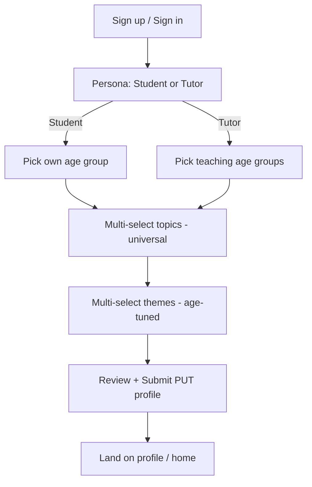
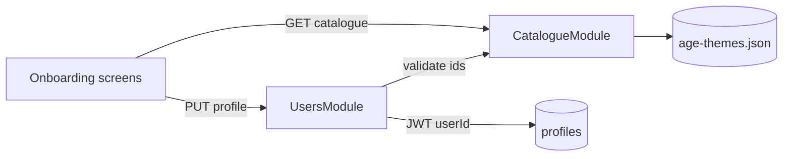

# Onboarding (student + tutor personas)

## Goal
After sign-up, users pick a persona (student or tutor), an age group (5–45), and multi-select learning topics plus age-tuned video themes so EduReels can personalize generated videos and catalogue UX.

## Assumptions
- Auth JWT already issues a user id; onboarding completes the `profiles` row.
- Catalogue age groups / topics / themes are static JSON (seeded), not user-authored.
- Topics are universal across ages; themes are age-bucket-specific.
- Tutors select the age groups they teach + topics they cover; students select their own age + interests.

## Out of scope
- Video generation, analytics widgets, quiz unlocks, ElevenLabs/TTS.
- Editing profile after first complete (can PATCH later; not in MVP UI).
- Real Supabase Auth UI polish beyond token-guarded profile write.
- Playwright sanity (explicitly skipped this delivery).
- Seeding catalogue rows into Postgres (catalogue remains JSON; profiles store id arrays).

## API contract (FROZEN)

### `GET /api/v1/catalogue`
| | |
|---|---|
| Auth | Bearer JWT (or `@Public()` for onboarding pre-auth; MVP: Public) |
| Request | none |
| Response `200` | `{ ageGroups: AgeGroup[], topics: Topic[], themesByAgeGroup: Record<ageGroupId, Theme[]> }` |
| Errors | `500` standard `{statusCode,message,error}` |

Types:
- `AgeGroup`: `{ id: string, label: string, minAge: number, maxAge: number }`
- `Topic`: `{ id: string, domain: string, label: string }`
- `Theme`: `{ id: string, label: string, vibe: string }`

### `GET /api/v1/catalogue/age-groups/:ageGroupId/themes`
| | |
|---|---|
| Auth | Public |
| Response `200` | `{ ageGroupId: string, themes: Theme[] }` |
| Errors | `404` unknown ageGroupId |

### `GET /api/v1/users/me/profile`
| | |
|---|---|
| Auth | Bearer JWT — user id from token |
| Response `200` | `Profile` |
| Errors | `401`, `404` if no profile yet |

### `PUT /api/v1/users/me/profile`
| | |
|---|---|
| Auth | Bearer JWT — user id from token **never** body |
| Request | `CompleteProfileDto`: `persona: 'student'\|'tutor'`, `ageGroupId: string` (student) **or** `teachingAgeGroupIds: string[]` (tutor, min 1), `topicIds: string[]` (min 1, max 12), `themeIds: string[]` (min 1, max 8), `displayName?: string` (2–40), `uiTheme?: 'lagoon'\|'ink'` |
| Response `200` | `Profile` with `onboardingComplete: true` |
| Errors | `400` validation, `401`, `404` unknown catalogue ids |

### `PATCH /api/v1/users/me/profile/theme` (additive)
| | |
|---|---|
| Auth | Bearer JWT |
| Request | `{ uiTheme: 'lagoon'\|'ink' }` |
| Response `200` | `Profile` |
| Errors | `400`, `401`, `404` |

`Profile`: `{ userId, persona, ageGroupId | null, teachingAgeGroupIds, topicIds, themeIds, displayName, onboardingComplete, onboardingCompletedAt | null, uiTheme, updatedAt }`

## DB delta
- Source of truth: `backend/migrations/002_profiles_supabase.sql` (supersedes sketch in `001_*`).
- `profiles` table (text `user_id` PK for MVP Bearer-userId; migrate to uuid FK → auth.users when Supabase Auth lands):
  - `persona`, `age_group_id`, `teaching_age_group_ids text[]`, `topic_ids text[]`, `theme_ids text[]`
  - `display_name`, `onboarding_complete boolean`, `onboarding_completed_at timestamptz null`
  - `ui_theme text check (ui_theme in ('lagoon','ink')) default 'lagoon'`
  - `updated_at timestamptz`
- Catalogue stays JSON-seeded (`age-themes.json`); profile stores catalogue **ids** (not FKs).
- Env (never commit secrets): `SUPABASE_URL`, `SUPABASE_SERVICE_ROLE_KEY` (server). Optional later: anon key for FE Auth.

## UI states
| Screen | loading | empty | error | success | testIDs |
|---|---|---|---|---|---|
| Persona | spinner | — | retry | student/tutor cards | `onboarding-persona`, `persona-student`, `persona-tutor` |
| Age group | spinner | — | retry | chip list | `onboarding-age`, `age-chip-<id>` |
| Topics | spinner | "No topics" | retry | multi-select chips | `onboarding-topics`, `topic-chip-<id>` |
| Themes | spinner | "Pick an age first" | retry | multi-select chips | `onboarding-themes`, `theme-chip-<id>` |
| Review/submit | submitting | — | inline + retry | navigates to profile | `onboarding-submit`, `onboarding-error` |
| UI theme picker | — | — | — | lagoon/ink chips applied live | `theme-picker`, `theme-lagoon`, `theme-ink` |

## UI color themes (persistent)
- **lagoon** (default): deep teal/cyan brand on cool paper — not purple, not terracotta cream.
  - bg `#F2F7F6`, surface `#FFFFFF`, text `#0B1F1C`, muted `#5B6E6A`, accent `#0D7377`, border `#C9D9D5`, success `#1F7A4C`, error `#B42318`
- **ink**: charcoal slate with seafoam accent (light “pro” mode, not generic dark glow).
  - bg `#12181A`, surface `#1C2528`, text `#E8F0EE`, muted `#8FA3A0`, accent `#3DDC97`, border `#2E3A3D`, success `#3DDC97`, error `#F07178`
- Persist: AsyncStorage key `edureels.uiTheme` (RN-web + native) **and** `profiles.ui_theme` via PATCH when profile exists.
- Tokens exposed as NativeWind `colors.app.*` + runtime CSS variables on web via `ThemeProvider`.

## Parallelization verdict
**PARALLEL** — profile CRUD + static catalogue; persistence is a repository swap. UI theme is additive PATCH + local store.

## Skill plan
| Stage | Run/Skip | Reason |
|---|---|---|
| 2 Design | RUN | New onboarding screens |
| 3 Backend | RUN | catalogue + users profile |
| 4 Frontend | RUN | persona → age → topics → themes |
| 5 Integrate | RUN | swap mocks → real client |
| 6 Playwright | SKIP | user request |
| 7 Review | RUN | touches auth/users |
| 8 Ship | RUN | feat/onboarding PR, no merge |

## Estimate
Spec 20 · Design 25 · BE 60 · FE 75 · Integrate 15 · Review/Ship 20. Total ~215 min (cut themes screen polish if over).

## Catalogue data
Canonical file: `backend/src/modules/catalogue/data/age-themes.json` (mirrored for FE mocks).

## User flow

## Data flow

## Design
- **Component tree**: `ThemeProvider` → `OnboardingLayout` → steps + `ThemePicker` (View/Text/Pressable chips).
- **NativeWind**: `bg-app-bg`, `bg-app-surface`, `text-app-text`, `text-app-muted`, selected chips `bg-app-accent text-white`, CTA `bg-app-accent rounded-2xl min-h-[44px]`.
- **Navigation**: unchanged `(onboarding)/*` → `(tabs)/profile`; theme picker on persona + profile.
- **testIDs**: as in UI states table.

## Persistence note (2026-07-18)
In-memory `UsersRepository` replaced by Supabase client (`@supabase/supabase-js`) using service role on the Nest server. Migration applied via Supabase MCP + kept in repo.
