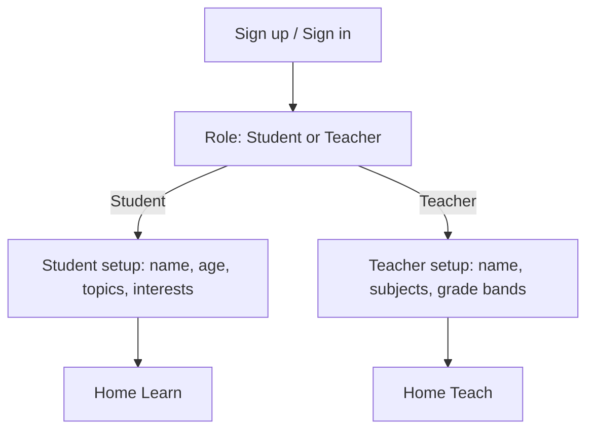

# Onboarding (student + teacher) — Next.js web

## Goal
After sign-up, users pick a role (student or teacher), complete a single setup page, then land on a persona-specific home. Canonical UI is Next.js under `web/` (mobile-friendly responsive layout).

## Assumptions
- Auth is Supabase email/password; Nest verifies JWT (JWKS or `SUPABASE_JWT_SECRET`).
- Catalogue topics/interests are in-memory seeds (`CatalogueStore`); profiles store id arrays.
- Local API demos may use `AUTH_DEV_BYPASS=true` + `x-user-id` (no browser session).

## Out of scope
- Expo / React Native app (`app/` removed).
- Legacy `persona`/`tutor`/`themeIds` multi-step flow.
- Editing profile after first complete (MVP).

## API contract (FROZEN — web)

### `POST /api/v1/auth/bootstrap`
| | |
|---|---|
| Auth | Bearer JWT |
| Response `200` | `{ profile: Profile }` (creates stub if missing) |

### `GET /api/v1/catalogue`
| | |
|---|---|
| Auth | Public |
| Response `200` | `{ topics: CatalogueItem[], interests: CatalogueItem[] }` |

`CatalogueItem`: `{ id: uuid, slug: string, label: string }`

### `GET /api/v1/profiles/me`
| | |
|---|---|
| Auth | Bearer JWT |
| Response `200` | `{ profile: Profile }` |

### `PUT /api/v1/profiles/onboarding`
| | |
|---|---|
| Auth | Bearer JWT |
| Student body | `{ role: 'student', displayName, ageGroup, topicIds (≥2), interestIds (≥2) }` |
| Teacher body | `{ role: 'teacher', displayName, subjectIds (≥1), gradeBands (≥1) }` |
| Response `200` | `{ profile }` with `onboardingComplete: true` |

`ageGroup` / `gradeBands`: `'8-10' | '11-13' | '14-16' | '17-18'`

`Profile`: `{ userId, role, displayName, ageGroup, onboardingComplete, topics, interests, subjects, gradeBands }`

## DB delta
- Source of truth: `backend/migrations/002_role_onboarding.sql` (+ `001_videos_hls.sql` for HLS).
- Legacy Expo migrations `001_onboarding_profiles.sql` / `002_profiles_supabase.sql` are obsolete.

## UI states
| Screen | URL | testIDs |
|---|---|---|
| Login / Sign up | `/login` | `auth-email`, `auth-password`, `auth-submit`, `auth-mode-toggle` |
| Role | `/role` | `role-student`, `role-teacher` |
| Student setup | `/onboarding?role=student` | `chip-topic-*`, `chip-interest-*`, `onboarding-submit` |
| Teacher setup | `/onboarding?role=teacher` | `chip-topic-*`, `onboarding-submit` |
| Home | `/home` | `generate-submit` |

## Parallelization verdict
**PARALLEL** — profile CRUD + static catalogue; UI is one setup page per role.

## Skill plan
| Stage | Run/Skip | Reason |
|---|---|---|
| Design | SKIP | Web screens already in `web/` |
| Backend | RUN | Wire Profiles + Generation; drop UsersModule |
| Frontend | SKIP | Keep latest Next flow |
| Verify | RUN | Playwright + `sanity-onboarding` script |

## User flow

