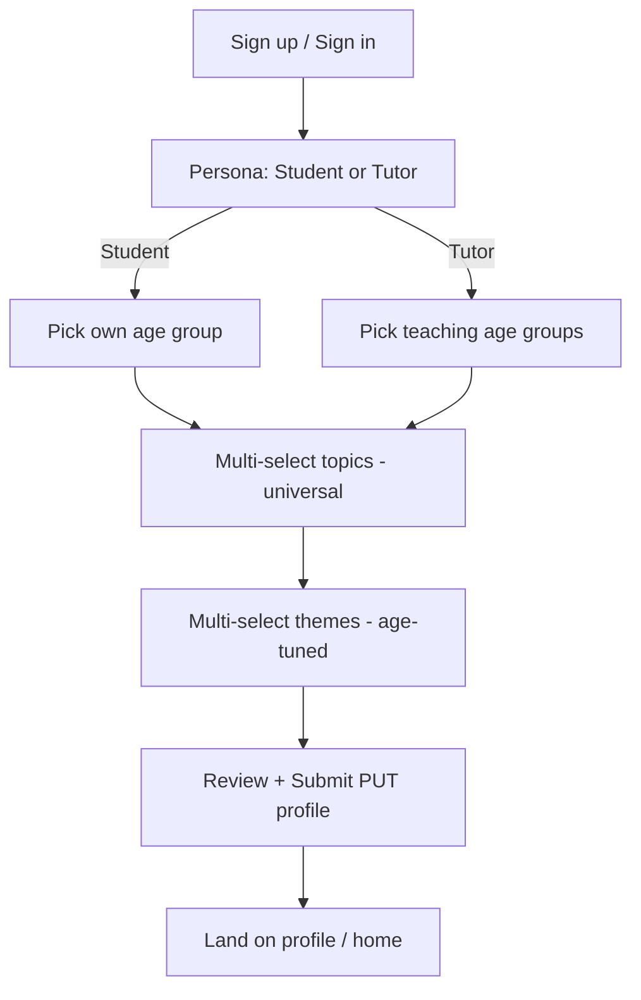
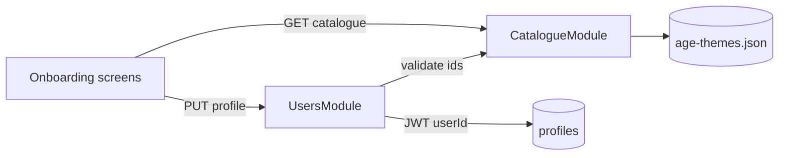

# Onboarding (student + tutor personas)

## Goal
After sign-up, users pick a persona (student or tutor), an age group (5–45), and multi-select learning topics plus age-tuned video themes so EduReels can personalize generated videos and catalogue UX.

## Assumptions
- Auth JWT already issues a user id; onboarding completes the `profiles` row.
- Catalogue age groups / topics / themes are static JSON (seeded), not user-authored.
- Topics are universal across ages; themes are age-bucket-specific.
- Tutors select the age groups they teach + topics they cover; students select their own age + interests.

## Out of scope
- Video generation, analytics widgets, quiz unlocks, ElevenLabs/TTS.
- Editing profile after first complete (can PATCH later; not in MVP UI).
- Real Supabase Auth UI polish beyond token-guarded profile write.
- Playwright sanity (explicitly skipped this delivery).

## API contract (FROZEN)

### `GET /api/v1/catalogue`
| | |
|---|---|
| Auth | Bearer JWT (or `@Public()` for onboarding pre-auth; MVP: Public) |
| Request | none |
| Response `200` | `{ ageGroups: AgeGroup[], topics: Topic[], themesByAgeGroup: Record<ageGroupId, Theme[]> }` |
| Errors | `500` standard `{statusCode,message,error}` |

Types:
- `AgeGroup`: `{ id: string, label: string, minAge: number, maxAge: number }`
- `Topic`: `{ id: string, domain: string, label: string }`
- `Theme`: `{ id: string, label: string, vibe: string }`

### `GET /api/v1/catalogue/age-groups/:ageGroupId/themes`
| | |
|---|---|
| Auth | Public |
| Response `200` | `{ ageGroupId: string, themes: Theme[] }` |
| Errors | `404` unknown ageGroupId |

### `GET /api/v1/users/me/profile`
| | |
|---|---|
| Auth | Bearer JWT — user id from token |
| Response `200` | `Profile` |
| Errors | `401`, `404` if no profile yet |

### `PUT /api/v1/users/me/profile`
| | |
|---|---|
| Auth | Bearer JWT — user id from token **never** body |
| Request | `CompleteProfileDto`: `persona: 'student'\|'tutor'`, `ageGroupId: string` (student) **or** `teachingAgeGroupIds: string[]` (tutor, min 1), `topicIds: string[]` (min 1, max 12), `themeIds: string[]` (min 1, max 8), `displayName?: string` (2–40) |
| Response `200` | `Profile` with `onboardingComplete: true` |
| Errors | `400` validation, `401`, `404` unknown catalogue ids |

`Profile`: `{ userId, persona, ageGroupId | null, teachingAgeGroupIds, topicIds, themeIds, displayName, onboardingComplete, updatedAt }`

## DB delta
- `profiles`: add `persona text check (persona in ('student','tutor'))`, `age_group_id text null`, `teaching_age_group_ids text[] default '{}'`, `topic_ids text[] default '{}'`, `theme_ids text[] default '{}'`, `display_name text null`, `onboarding_complete boolean default false`, `updated_at timestamptz`.
- Catalogue tables optional for MVP: serve from `backend/src/modules/catalogue/data/age-themes.json`; migration may seed `catalogue_topics` / `catalogue_interests` later.
- See `backend/migrations/001_onboarding_profiles.sql`.

## UI states
| Screen | loading | empty | error | success | testIDs |
|---|---|---|---|---|---|
| Persona | spinner | — | retry | student/tutor cards | `onboarding-persona`, `persona-student`, `persona-tutor` |
| Age group | spinner | — | retry | chip list | `onboarding-age`, `age-chip-<id>` |
| Topics | spinner | "No topics" | retry | multi-select chips | `onboarding-topics`, `topic-chip-<id>` |
| Themes | spinner | "Pick an age first" | retry | multi-select chips | `onboarding-themes`, `theme-chip-<id>` |
| Review/submit | submitting | — | inline + retry | navigates to profile | `onboarding-submit`, `onboarding-error` |

## Parallelization verdict
**PARALLEL** — standard CRUD profile + static catalogue; FE builds against mocks from this contract while BE implements the same shapes. Persona differences are DTO branches only.

## Skill plan
| Stage | Run/Skip | Reason |
|---|---|---|
| 2 Design | RUN | New onboarding screens |
| 3 Backend | RUN | catalogue + users profile |
| 4 Frontend | RUN | persona → age → topics → themes |
| 5 Integrate | RUN | swap mocks → real client |
| 6 Playwright | SKIP | user request |
| 7 Review | RUN | touches auth/users |
| 8 Ship | RUN | feat/onboarding PR, no merge |

## Estimate
Spec 20 · Design 25 · BE 60 · FE 75 · Integrate 15 · Review/Ship 20. Total ~215 min (cut themes screen polish if over).

## Catalogue data
Canonical file: `backend/src/modules/catalogue/data/age-themes.json` (mirrored for FE mocks).

## User flow

## Data flow

## Design
- **Component tree**: `OnboardingLayout` → `PersonaStep` | `AgeStep` | `TopicsStep` | `ThemesStep` | `ReviewStep` (View/Text/Pressable/FlatList chips).
- **NativeWind**: `flex-1 bg-slate-50`, chips `rounded-full px-4 py-3`, selected `bg-teal-600 text-white`, primary CTA `bg-teal-700 rounded-2xl min-h-[44px]`.
- **Navigation**: `app/(onboarding)/persona.tsx` → `age.tsx` → `topics.tsx` → `themes.tsx` → `review.tsx`; gate from auth if `!onboardingComplete`.
- **testIDs**: as in UI states table.
