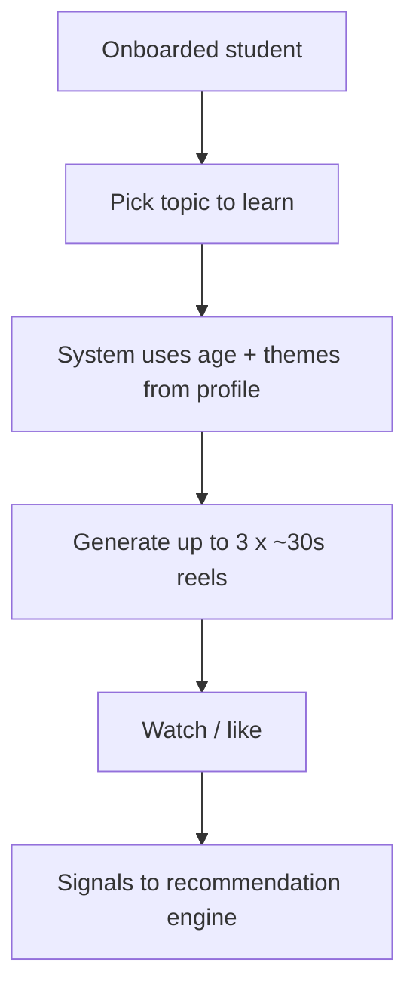
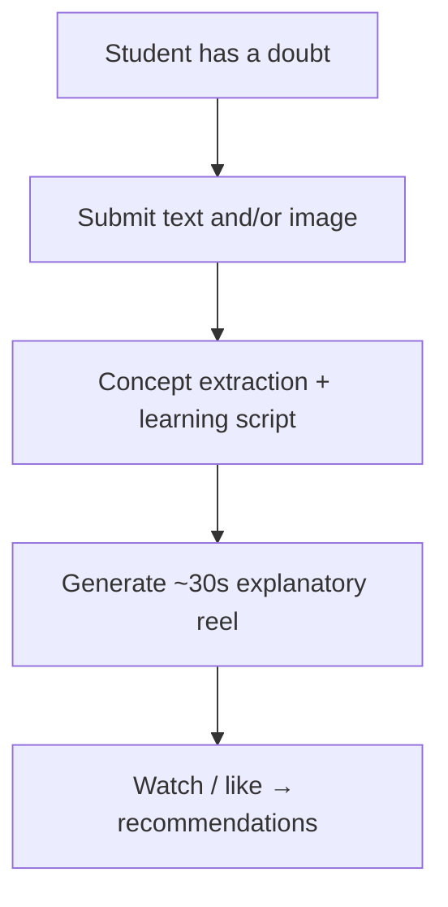
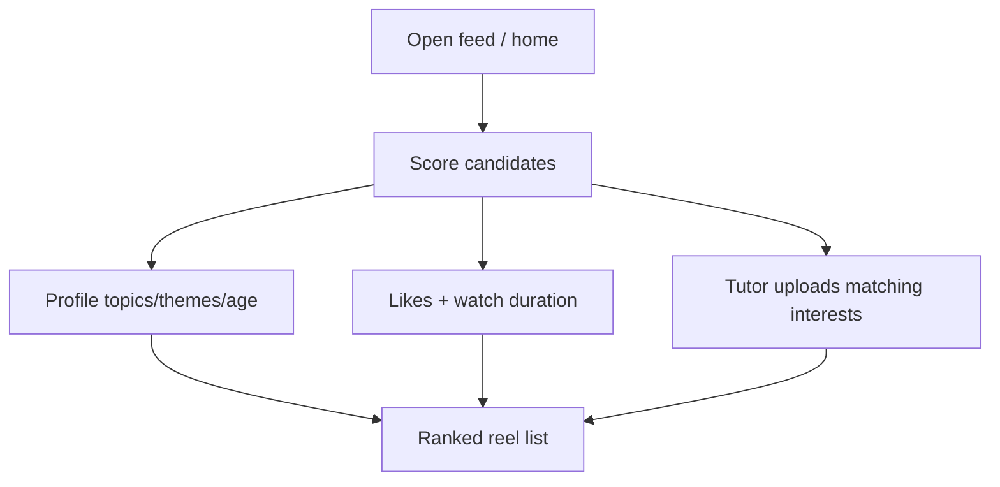
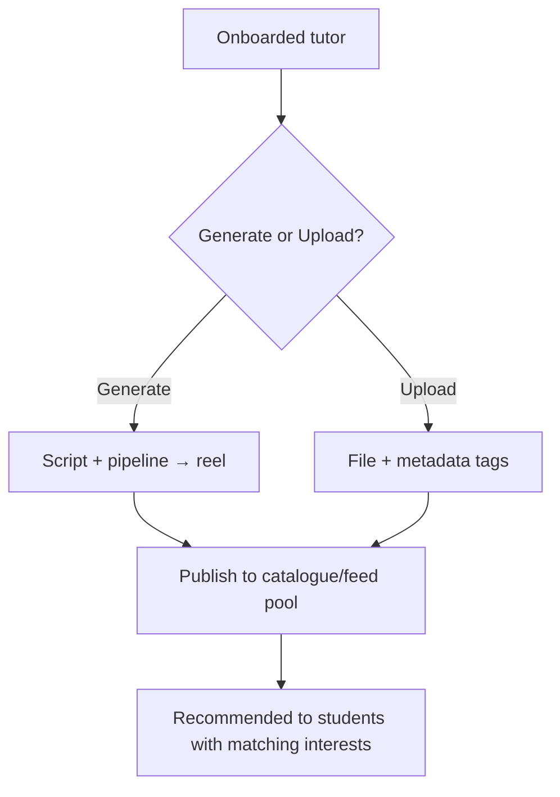

# EduReels — Product Requirements Document (PRD)

## 1. Product summary

EduReels is an AI educational video platform that turns a learner’s **age group**, **learning topics**, and **entertainment / series interests** into short, personalized learning reels (~30 seconds). Students discover concept micro-videos; tutors can also create and upload content that surfaces through the same interest-aware recommendation loop.

| | |
|---|---|
| **Working name** | EduReels |
| **Primary user** | Student (learner) |
| **Secondary user** | Tutor (content creator / mentor) |
| **Core format** | Vertical short learning video, **~30 seconds** each |
| **Personalization inputs** | Age group, topic of interest, entertainment / movie-series themes |
| **Platform** | React Native (web-first) + NestJS + Supabase; Remotion + ElevenLabs (TTS) |

Related specs: [`onboarding.md`](./onboarding.md) (persona, age, topics, themes → profile). Catalogue data: `backend/src/modules/catalogue/data/age-themes.json`.

---

## 2. Problem & goals

### Problem
Generic lessons ignore how GenZ (and other ages) actually engage with media. Students disengage from abstract topics; tutors cannot scale 1:1 explanation; doubts wait for human reply; feeds lack signal from what the learner *actually* watches and likes.

### Product goals
1. Generate **at most three** short learning videos for a selected topic (and related concepts), framed with the student’s entertainment interests.
2. Resolve **doubts** (text or image) as engaging explanatory reels—not dry, textbook-style walkthroughs.
3. Recommend the next reel using **likes** and **watch duration**.
4. Let **tutors** generate and upload their own videos, recommended to students by shared interests.

### Non-goals (this PRD level)
- Full LMS (courses, grades, attendance).
- Live video calls or real-time tutoring chat.
- Multi-language production pipeline (may be later).
- Unlimited generation volume (credit-aware; fixture TTS in dev/tests).

---

## 3. Personas

| Persona | Role | Key jobs |
|---|---|---|
| **Student** | Learner | Complete onboarding; pick topic + interests; watch ≤3 generated reels per topic request; submit doubts; like/watch; receive recommendations (AI + tutor content). |
| **Tutor** | Creator | Onboard with teaching ages/topics/themes; generate or upload reels; have content recommended to matching students. |

Onboarding details and profile fields are frozen in [`onboarding.md`](./onboarding.md).

---

## 4. Feature list

### 4.1 Primary functionality — Personalized topic video generation

**Intent:** From a student’s selections, produce short learning reels that teach a topic/concept *through* their entertainment lens.

| Item | Requirement |
|---|---|
| **Inputs** | Age group; topic of interest (learning domain); entertainment / movie-series interests (themes from catalogue). |
| **Output** | Up to **three** videos per generation request for that topic and closely related concepts. |
| **Duration** | Target **~30 seconds** per video. |
| **Style** | Learning-oriented storytelling; examples and metaphors drawn from selected themes (e.g. Pokémon framing for ages 5–10), not generic lecture slides. |
| **Pipeline (conceptual)** | Profile + topic → script(s) for ≤3 concepts → TTS (cached / fixture in non-prod) → Remotion timeline → playable reel(s) in player. |
| **Success** | Student can trigger generation, see ≤3 reels, play them with scene advance, and have watch events available for analytics/recommendations. |

**Example:** Student age 11–14, topic “Photosynthesis”, themes “Minecraft / anime FYP” → up to three ~30s reels covering core concept + 1–2 related concepts, each narrated with that vibe.

**Out of scope for primary MVP slice:** Batch generation for entire curriculum; multi-topic packs in one click; offline download.

---

### 4.2 Other feature — Doubt-to-video explanation

**Intent:** When a student is stuck, they submit a doubt as **text and/or image**; the system generates a short reel that explains the concept in a **learning / narrative way**, not a blunt answer dump.

| Item | Requirement |
|---|---|
| **Inputs** | Text description and/or image (e.g. homework photo, diagram); optional topic hint; reuse student age + themes from profile when available. |
| **Output** | One short explanatory video (~30s target) that teaches the underlying concept with interest-aware framing. |
| **Pedagogy rule** | Prefer analogy, worked intuition, and “why it works” over “here is the final answer only.” |
| **Success** | Student submits doubt → job completes → playable reel; failure states are clear (upload/OCR/generation errors). |

**Out of scope:** Guaranteed exam-answer accuracy certification; human tutor escalation workflow; long multi-part doubt threads.

---

### 4.3 Other feature — Recommendation engine

**Intent:** Surface the next videos using engagement signals so the feed improves with use.

| Signal | Use |
|---|---|
| **Likes** | Positive preference for topic/theme/creator/style. |
| **Watch duration** | Completion / dwell as interest strength (e.g. % of 30s watched). |

| Item | Requirement |
|---|---|
| **Candidates** | AI-generated topic reels, doubt-resolution reels, and **tutor-uploaded** reels. |
| **Personalization** | Weight student profile (topics, themes, age) + engagement history. |
| **Tutor content rule** | Tutor-uploaded videos are recommended when they align with the **student’s interests** (topics/themes/age fit). |
| **Success** | Feed/home shows ranked recommendations that change as likes and watch-time accumulate. |

**Out of scope (initial):** Collaborative filtering at large scale; A/B experimentation platform; paid promotion of tutor content.

---

### 4.4 Other feature — Tutor generate & upload

**Intent:** Tutors in the firm can **generate** and **upload** their own learning videos into the catalogue/feed path.

| Item | Requirement |
|---|---|
| **Generate** | Tutor may run a generation flow scoped to teaching age groups / topics / themes from their profile (same ~30s reel constraints where applicable). |
| **Upload** | Tutor uploads video asset + metadata (title, topic ids, theme tags, target age groups, description). |
| **Discovery** | Uploaded (and tutor-generated) items enter the recommendation pool for students with matching interests. |
| **Success** | Tutor publishes content; eligible students see it via recommendations or topic browse. |

**Out of scope:** Marketplace payments; copyright scanning; live class scheduling.

---

### 4.5 Supporting features (already in progress or implied)

| Feature | Status / note |
|---|---|
| **Onboarding (student + tutor)** | Spec’d & implemented path in [`onboarding.md`](./onboarding.md) — persona, age, topics, themes, UI theme. |
| **Profile persistence** | Supabase `profiles` (see onboarding migration). |
| **Catalogue (age → themes, universal topics)** | Static JSON seed; feeds generation + tutor tagging. |
| **Video player** | Play reel, scene advance; emits watch-time for recommendations/analytics. |
| **Auth** | Bearer/JWT user identity; harden to Supabase Auth as needed. |

---

## 5. Feature priority (delivery view)

| Priority | Feature | Rationale |
|---|---|---|
| **P0** | Onboarding + profile | Required inputs for all generation/recommendation. |
| **P0** | Personalized topic generation (≤3 × ~30s) | Primary product promise. |
| **P1** | Player + watch-time / like events | Unlocks recommendations and demo credibility. |
| **P1** | Recommendation feed (rules + engagement) | Retention and “adaptive” narrative. |
| **P2** | Doubt → video (text first, image next) | High wow; heavier pipeline (vision/OCR). |
| **P2** | Tutor upload + generate | Dual-sided marketplace feel; depends on metadata + recs. |

---

## 6. User journeys (high level)

### 6.1 Student — topic learning pack

### 6.2 Student — doubt resolution

### 6.3 Student — recommendations

### 6.4 Tutor — create & reach students

---

## 7. Data concepts (PRD level)

| Entity | Purpose |
|---|---|
| **Profile** | Persona, age/teaching ages, topic ids, theme ids, UI theme, onboarding flags. |
| **Catalogue** | Age groups, universal topics, age-tuned themes (JSON seed). |
| **GenerationJob** | Request type (`topic_pack` \| `doubt`), inputs, status, resulting video ids (≤3 for topic pack). |
| **Video** | ~30s asset + timeline metadata; source `ai_generated` \| `tutor_upload`; topic/theme/age tags; creator id. |
| **Doubt** | Text and/or image ref; linked job + video. |
| **EngagementEvent** | `like`, `watch_progress` (duration / %); drives recommendations. |
| **RecommendationSnapshot** | Optional cached ranked list per student (implementation detail). |

Detailed API/DB contracts freeze in per-feature specs under `/specs/` before implementation (AGENTS.md Stage 1).

---

## 8. Constraints & principles

- **Length:** Default reel length ~**30 seconds**.
- **Volume:** Topic pack → **maximum three** videos per request for that topic/related concepts.
- **Personalization:** Always prefer profile age + themes when generating or explaining.
- **Doubt pedagogy:** Learning narrative > answer-only dumps.
- **Recommendations:** Combine explicit likes, watch duration, and interest overlap (including tutor content).
- **Credits:** ElevenLabs is paid/limited — cache TTS by hash; fixtures in tests/dev loops; never call TTS in CI thrash.
- **No new paid cloud deps** beyond existing approved stack without team agreement.
- **FE:** React Native + web; no web-only APIs outside `*.web.tsx`.

---

## 9. Success metrics (MVP)

| Metric | Target (directional) |
|---|---|
| Topic pack completion | Student receives 1–3 playable reels for a topic request |
| Watch engagement | Median watch ≥ 50% of reel duration on first session |
| Doubt loop | Text doubt → playable explanation reel in one continuous demo |
| Rec relevance | ≥1 recommended item matches a liked topic/theme in session |
| Tutor publish | Tutor can upload or generate and see item eligible for student recs |

---

## 10. Open questions

1. Image doubts: OCR-only vs multimodal vision model (cost / hackathon feasibility).
2. Exact ranking formula weights (likes vs completion vs recency vs tutor boost).
3. Tutor upload storage (Supabase Storage path, size/type limits, moderation).
4. Whether “related concepts” for the 3-video pack are LLM-chosen or catalogue-graph driven.
5. Student ability to regenerate a pack vs locked once-per-topic for credit control.

---

## 11. Spec follow-ups (implementation)

Create frozen feature specs before coding each slice:

| Spec file (suggested) | Covers |
|---|---|
| `specs/video-generation.md` | Topic pack ≤3 × 30s; pipeline; API |
| `specs/doubt-to-video.md` | Text/image doubt → explanatory reel |
| `specs/recommendations.md` | Likes, watch duration, ranking, tutor content |
| `specs/tutor-uploads.md` | Generate + upload + metadata + publish |

This PRD is the **product feature list and intent**; those specs freeze contracts for BE/FE delivery.
